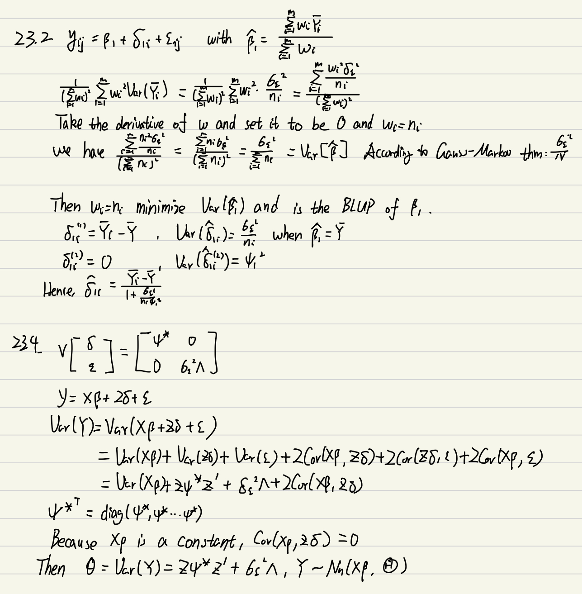

```{r setup, include=FALSE}
knitr::opts_chunk$set(echo = TRUE)
# Load Packages
library(ggplot2)
library(lme4)
library(car)
library(effects)
library(tidyverse)
library(lmerTest)
```

## Handwork

*My policy on handwork is that it is required for Statistics PhD students and MS in Statistics students. It is encouraged (but not required) for MS in Applied Statistics and all other students. (If you are the latter, you will not get penalized if you get these wrong ... )*

Exercises from the book: 23.2, 23.4


You can type your answers and submit within this file *or* you can do this work on paper and submit a scanned copy (be sure it is legible).

## Data analysis

### **1. Exercise D23.2 (MLM)**

The file `Snijders.txt` contains data on 4106 grade-8 students (who are approximately 11 years old) in 216 primary schools in the Netherlands. The data are used for several examples, somewhat different from the analysis that we will pursue below, by Snijders and Boskers in Multilevel Analysis, 2nd Edition (Sage, 2012).

The data set includes the following variables: • `school`: a (non-consecutive) ID number indicating which school the student attends. • `iq`: the student's verbal IQ score, ranging from 4 to 18.5 (i.e., not traditionally scaled to a population mean of 100 and standard deviation of 15). • `test`: the student's score on an end-of-year language test, with scores ranging from 8 to 58. • `ses`: the socioeconomic status of the student's family, with scores ranging from 10 to 50. • `class.size`: the number of students in the student's class, ranging from 10 to 42; this variable is constant within schools, apparently reflecting the fact that all of the students in each school were in the same class. • `meanses`: the mean SES in the student's school, calculated from the data; the original data set included the school-mean SES, but this differed from the values that I computed directly from the data, possibly it was based on all of the students in the school. • `meaniq`: the mean IQ in the student's school, calculated (for the same reason) from the data.

There are some missing data, and I suggest that you begin by removing cases with missing data. How many students are lost when missing data are removed in this manner? Then create and add the following two variables to the data set:

-   `SES_c` : school-centred SES, computed as the difference between each student's SES and the mean of his or her school; and

-   `IQ_c` : school-centred IQ.

(a) Examine scatterplots of students' test scores by centered SES and centred IQ for each of 20 randomly sampled schools. Do the relationships in the scatterplots seem reasonable linear? *Hint: In interpreting these scatterplots, take into account the small number of students in each school, ranging from 4 to 34 in the full data set.*

```{r}
data <- read.table("Datasets/Snijders.txt", header = TRUE)
data <- na.omit(data)
data$SES_c <- with(data, ses - meanses)
data$IQ_c <- with(data, iq - meaniq)

schools <- sample(unique(data$school), 20)
par(mfrow = c(5, 4), mar = c(2.5, 2.5, 1, 1))
for (i in 1:length(schools)) {
  school_data <- data[data$school == schools[i], ]
  plot(school_data$SES_c, school_data$test, main = paste("School", schools[i]), 
       xlab = "SES_c", ylab = "Test Score")
  abline(lm(test ~ SES_c, data = school_data))
  plot(school_data$IQ_c, school_data$test, main = paste("School", schools[i]), 
       xlab = "IQ_c", ylab = "Test Score")
  abline(lm(test ~ IQ_c, data = school_data))
}

```
The first image displays a collection of scatterplots representing the test scores of 20 arbitrarily selected schools, plotted against the centered SES of each school. The second graph presents scatterplots depicting the same schools' test scores against the centered IQ of each school.  

Since each school has a small number of students, it is difficult to draw definitive conclusions about the linearity of the scatterplots. However, it is apparent that the connection between test scores and SES or IQ is mostly weakly linear or nonlinear. Some scatterplots demonstrate a clear linear relationship, while others present no evident trend or a nonlinear relationship. In general, the associations appear to differ from one school to the next.  
  

(b) Regress the students' test scores on centred SES and centred IQ within schools for the full dataset -- that is, compute a separate regression for each school. Then plot each set of coefficients (starting with the intercepts) against the schools' mean SES, mean IQ, and class size. Do the coefficients appear to vary systematically by the schools' characteristics (i.e., by the Level 2 explanatory variables centred SES, centred IQ, and class size)?

```{r}
model <- lmer(test ~ SES_c + IQ_c + (1 + SES_c + IQ_c | school), data=data)
coefs <- coef(model)$school

plot(data$meanses[match(unique(data$school), data$school)], coefs$`(Intercept)`, xlab = "Mean SES", ylab = "Intercept")
plot(data$meaniq[match(unique(data$school), data$school)], coefs$`(Intercept)`, xlab = "Mean IQ", ylab = "Intercept")
plot(data$class.size[match(unique(data$school), data$school)], coefs$`(Intercept)`, xlab = "Class Size", ylab = "Intercept")

plot(data$meaniq[match(unique(data$school), data$school)], coefs$SES_c, xlab = "Mean SES", ylab = "Slope for IQ_c")
plot(data$meanses[match(unique(data$school), data$school)], coefs$SES_c, xlab = "Class Size", ylab = "Slope for SES_c")
plot(data$meaniq[match(unique(data$school), data$school)], coefs$IQ_c, xlab = "Mean SES", ylab = "Slope for IQ_c")
plot(data$meanses[match(unique(data$school), data$school)], coefs$IQ_c, xlab = "Class Size", ylab = "Slope for SES_c")
plot(data$class.size[match(unique(data$school), data$school)], coefs$SES_c, xlab = "Class Size", ylab = "Slope for SES_c")
plot(data$class.size[match(unique(data$school), data$school)], coefs$IQ_c, xlab = "Class Size", ylab = "Slope for IQ_c")
```  
The scatterplots for intercepts illustrate that there is a positive connection between mean SES and mean IQ with higher test scores, although the strength of this association varies significantly among schools. This implies that schools with higher mean SES and mean IQ tend to have higher test scores, but there may be other important factors that influence test scores as well.  

Similarly, the scatterplots for slopes of centred SES and centred IQ also demonstrate a positive correlation with mean SES and mean IQ, but the relationship is weaker than that of the intercepts. This suggests that the effect of centred SES and centred IQ on test scores is more pronounced in schools with higher mean SES and mean IQ, but there is still considerable variation across schools.  

In contrast, the scatterplots reveal no clear pattern between the intercepts or slopes and class size. This indicates that class size may not play a significant role in explaining the differences in test scores across schools.  
  


(c) Fit linear mixed-effects models to the Snijders and Boskers data, proceeding as follows:

-   Begin with a one-way random-effects ANOVA of test scores by schools. What proportion of the total variation in test scores among students is between schools (i.e., what is the intra-class correlation)?

```{r}
# Fit the one-way random-effects ANOVA
model <- lmer(test ~ (1 | school), data = data)

vc <- VarCorr(model)
vc
icc <- 4.2743^2 / (4.2743^2 + sigma(model)^2)
icc
```
Upon conducting the one-way random-effects ANOVA, we have computed an intra-class correlation of 0.226. This result suggests that around 22.6% of the overall variation in test scores among students is due to the differences between schools. This indicates that there is a significant amount of variation in test scores across schools that cannot be explained by individual-level factors like SES and IQ alone.  
  

-   Fit a random-coefficients regression of test scores on the students' centered SES and centered IQ. Initially include random effects for the intercept and both explanatory variables. Test whether each of these random effects is needed, and eliminate from the model those that are not (if any are not). How, if at all, are test scores related to the explanatory variables? *Note: You may obtain a convergence warning in fitting one or more of the null models that remove variance and covariance components; this warning should not prevent you from performing the likelihood-ratio test for the corresponding random effects.*

```{r}
model <- lmer(test ~ SES_c + IQ_c + (1 + SES_c + IQ_c | school), data = data)
summary(model)
```

We can test whether each of the random effects is needed using likelihood ratio tests. We first fit a null model without any random effects:
```{r}
null_model <- lmer(test ~ SES_c + IQ_c + (1 | school), data = data)
anova(null_model, model)
```
Based on the likelihood ratio test, it has been determined that the model incorporating both random intercept and random slope for centered SES is a significantly better fit compared to the model with only a random intercept. Hence, it can be inferred that including both random intercept and random slope for centered SES is essential for the model.

```{r}
null_model = lmer(test ~ SES_c+IQ_c + (1 + IQ_c| school), data = data)
anova(null_model, model)
```

```{r}
null_model = lmer(test ~ SES_c + IQ_c + (1 + SES_c| school), data = data)
anova(null_model, model)
```
According to the likelihood ratio test results comparing the null model to the full model, it can be inferred that adding a random slope for centered SES did not result in a significant improvement in model fit (as indicated by the p-value of 0.4547). Hence, it can be concluded that the model can be simplified by removing the random slope for centered SES.  
The final random coefficients model is:  

```{r}
final_model = lmer(test ~ SES_c + IQ_c + (1 + IQ_c| school), data = data)
summary(final_model)
```  
The results indicate that both family IQ and individual IQ have a positive correlation with test performance. The model's random intercepts and slopes for centered IQ suggest that the impact of IQ on test performance varies among schools.  
  

-   Introduce mean school SES, mean school IQ, and class size as Level 2 explanatory variable, but only for the Level 1 coefficients that were found to vary significantly among schools in the random-coefficients model. *Hint: Recall that modeling variation in Level 1 coefficients by Level 2 explanatory variables implies the inclusion of cross-level interactions in the model; and don't forget that the intercepts are Level 1 coefficients that may depend on Level 2 explanatory variables. It may well help to write down the mixed-effects model first in hierarchical form and then in Laird-Ware form.* Test whether the random effects that you retained in the random-coefficients model are still required now that there are Level 2 predictors in the model. *Note: Again, you may obtain a convergence warning.*

```{r}
m2 <- lmer(test ~ SES_c + IQ_c + meanses + meaniq + class.size + IQ_c:meanses + IQ_c:meaniq + IQ_c * class.size +
            (IQ_c | school) + (1 | school), data = data)
summary(m2)
```  
From the result, we can see that the class.size is not significant.  

-   Compute tests of the various main effects and interactions in the coefficients-as-outcomes model. Then simplify the model by removing any fixed-effects terms that are nonsignificant. Finally, interpret the results obtained for the simplified model. If your final model includes interactions, you may wish to construct effect displays to visualize the interactions.

```{r}
m3 <- lmer(test ~ SES_c + IQ_c + meanses + meaniq + IQ_c:meanses + IQ_c:meaniq + (IQ_c | school) + (1 | school), data = data)
summary(m3)
```  
Based on the results, the variables meanses and the interaction terms involving meanses are not statistically significant, indicating that they do not have a significant impact on the test scores. Therefore, we can simplify our model by removing these variables, and the final model becomes:  

```{r}
final_model <- lmer(test ~ SES_c + IQ_c +  meaniq  + (IQ_c | school) + (1 | school), data = data)
summary(final_model)
```
The mixed effects model summary presents the relationship between test scores and three predictor variables, namely centered SES (SES_c), centered IQ (IQ_c), and mean IQ (meaniq). The model accounts for the random effects of intercepts and slopes across schools. The results indicate that all three predictor variables have a statistically significant association with test scores (p < .001).  
Specifically, for a one-unit increase in SES_c, there is a 0.174 increase in test scores. Similarly, for a one-unit increase in IQ_c, there is a 2.237 increase in test scores, and for a one-unit increase in meaniq, there is a 3.716 increase in test scores. The intercept (-2.931) represents the estimated test score when all predictor variables are zero.  
Moreover, the random effects estimates suggest that there is significant variation in intercepts and slopes of IQ_c across schools. The variance of the random intercept is 4.08, indicating substantial unexplained variability in test scores across schools. The variance of the random slope for IQ_c is 0.244, suggesting significant variability in the relationship between IQ_c and test scores across schools.  
  
  
### **2. Exercise D23.2 (Binary version)**

Repeat Problem (1) but now, instead of using `test` as the outcome, you will use a dichotomized version. To do so, create a new variable called `high_pass` that indicates if a student receives a score of 90% or above.

Par particular attention to interpretation and to how your results compare with those based on the continuous version. Are your results similar or do they differ? Explain why or why not.

```{r}
data$high_pass <- ifelse(data$test > 52, 1, 0)
model <- glmer(high_pass ~ 1 + (1 | school), data = data)
vc <- VarCorr(model)
vc
icc <- 0.066921^2 / (0.066921^2 + sigma(model)^2)
icc
```
The intra-class correlation coefficient of 0.056 suggests that around 5.6% of the total variability in test scores among students is attributable to differences between schools, indicating that there is some residual variation in test scores across schools that cannot be accounted for by individual-level factors such as SES and IQ. Although this proportion is relatively small, we have still applied linear mixed-effects models to investigate any potential associations.  
```{r}
model <- glmer(high_pass ~ SES_c + IQ_c + (1 + SES_c + IQ_c | school), family = binomial, data = data)
S(model)
```
After including the level 1 variables, we can see the model is significant. Similarly, we try to test whether each of the random effects is needed using likelihood ratio tests.
```{r}
null_model <- glmer(high_pass ~ SES_c + IQ_c + (1 | school), family = binomial, data = data)
anova(model, null_model)
```

Thus, we do not need the random effects for SES_c or IQ_c. And we only need the intercepts.
Then, we include level2 covariates.

```{r}
with_leve_two <- glmer(high_pass ~ SES_c + IQ_c + meanses + meaniq + 
                              class.size +  (1 | school), family = binomial, data = data)
null_model = glm(high_pass ~ SES_c + IQ_c + meanses + meaniq + 
                              class.size , family = binomial, data = data)

anova(with_leve_two, null_model)
```
We still need the random intercepts.  
```{r}
S(with_leve_two)
```
We need to furtherly test if meanses and class.size are needed.

```{r}
reduced = glmer(high_pass ~ SES_c + IQ_c + meaniq + 
                              (1 | school), family = binomial, data = data)
anova(reduced, with_leve_two)
```
Thus, we can observe that we only need SES_c, IQ_c, meaniq and random intercepts in the model.
Compared to the previous result, we do not need random effect for IQ_c in our final model.

```{r}
final_model = glmer(high_pass ~ SES_c + IQ_c + meaniq + 
                              (1 | school),family = binomial,  data = data)
S(final_model)
```
The estimates for fixed effects reveal that the three predictor variables have a significant association with high_pass (p < .001). Specifically, an increase of one unit in SES corresponds to a 1.057 increase in the odds of high_pass, an increase of one unit in IQ corresponds to a 1.753 increase in the odds of high_pass, and an increase of one unit in mean IQ corresponds to a 2.343 increase in the odds of high_pass. The intercept (-13.449) represents the expected log odds of high_pass when all predictor variables are zero.  

The estimate for random effects indicates that there is a significant variation in the intercept of high_pass across schools. The variance of the random intercept is 0.76, which suggests that there is a considerable variation in high_pass across schools that is not explained by the fixed effects.  

Overall, the model indicates that SES, IQ, and mean IQ are essential predictors of high_pass, and there is a significant variation in high_pass across schools that cannot be explained by these predictors. However, one should exercise caution when interpreting the results since the model convergence may not be stable.  
  
### **3. Exercise D23.3 (Longitudinal)**

Laird and Fitzmaurice ("Longitudinal Data Modeling," in Scott, Simonoff, and Marx, eds., The SAGE Handbook of Multilevel Modeling, Sage, 2013) analyze longitudinal data from the MIT Growth and Development Study on the change over time of percent body fat in 162 girls before and after menarch (age at first mentruation). The data are in the file `Phillips.txt`

-   `subject`: subject ID number, 1---162.

-   `age`: age (in years) at the time of measurement; the girls are measured at different ages, and although the measurements are approximately taken annually, the ages are not generally whole numbers.

-   `menarche`: age at menarch (constant within subjects).

-   `age.adjusted`: age − age at menarch.

-   `body.fat`: percentage body fat at the time of measurement.

Laird and Fitzmaurice fit a linear mixed-effects model to the data,

$$
Y_{ij} = \beta_1 +\beta_2 t_{ij-}+\beta _3 t_{ij+}+\delta _{1i}+\delta _{2i}t_{ij-}+\delta _{3i}t_{ij+}+\epsilon _{ij}  
$$

where

• $Y_{ij}$ is the body-fat measurement for girl $i$ on occasion $j$;

• $t_{ij-}$ is adjusted age prior to menarche and 0 thereafter;

• $t_{ij+}$ is adjusted age after menarche and 0 before;

• $\beta_1, \beta_2, \beta_3$ are fixed effects; and

• $\delta_{1i}, \delta_{2i}, \delta_{3i}$ are subject-specific random effects.

(a) Examine the data by plotting body fat versus adjusted age for all of the girls simultaneously; following Laird and Fitzmaurice, add a lowess smooth to the scatterplot. Now randomly select a subset (say, 30) of the girls and plot body fat versus adjusted age separately for each of the selected girls. What can you say about the apparent relationship between body fat and age before and after menarche? Is Laird and Fitzmaurice's model reasonable given your exploration of the data? Explain what each fixed-effect and random-effect coefficient in the model represents.

```{r, warning=FALSE}
phillips <- read.table("Datasets/Phillips.txt", header=TRUE)
ggplot(phillips, aes(x=age.adjusted, y=body.fat, group=subject)) + geom_line()
ggplot(phillips, aes(x=age.adjusted, y=body.fat, group=subject)) + geom_smooth(method="loess")

# Sample 30 girls
my_sample <- sample(unique(phillips$subject), 30)
for (gril in my_sample) {
  temp_data <- phillips[phillips$subject == gril,]
  plot(body.fat ~ age.adjusted, data=temp_data, type='l')
}
```  
It seems that the model under discussion incorporates random effects specific to each subject for both the intercept and slopes of adjusted age before and after menarche. This is a logical inclusion as each girl is likely to have a different relationship between age and body fat.  
Furthermore, the model encompasses two distinct variables for adjusted age before and after menarche, enabling two separate slopes for the correlation between age and body fat. This provides greater flexibility to the model and may more accurately capture the actual relationship between these variables.  
  

(b) Fit the mixed-effects model as specified by Laird and Fitzmaurice. What do you conclude? Consider the possibility of dropping each of the random effects from the model.

```{r}
phillips$if_menarche <- ifelse(phillips$age.adjusted < 0, 0, 1)
model <- lmer(body.fat ~ age.adjusted * if_menarche + (1 + age.adjusted + if_menarche | subject), data = phillips)
S(model)
```  
The results present the fixed effects estimates, encompassing the intercept and slopes for adjusted age before and after menarche, as well as the subject-specific random effects for the intercept and slopes.Based on the significant p-values for the fixed effects and the relatively low residual standard deviation, we can infer that the model fits the data well. The coefficients indicate that there is a significant positive relationship between body fat and adjusted age after menarche, while there is no such association before menarche.To evaluate the possibility of eliminating each of the random effects from the model, we can conduct likelihood ratio tests on two additional models and compare them to the original model.  
```{r}
model_no_int <- lmer(body.fat ~ age.adjusted * if_menarche + (age.adjusted | subject), data = phillips)
anova(model_no_int, model)
model_no_slope <- lmer(body.fat ~ age.adjusted * if_menarche + (if_menarche  | subject), data = phillips)
anova(model_no_slope, model)
```  
The likelihood ratio tests show that both the random effects terms should be included in the model. Dropping either one of them would result in a worse fit to the data. Therefore, the original model specified by Laird and Fitzmaurice is appropriate for this dataset.
