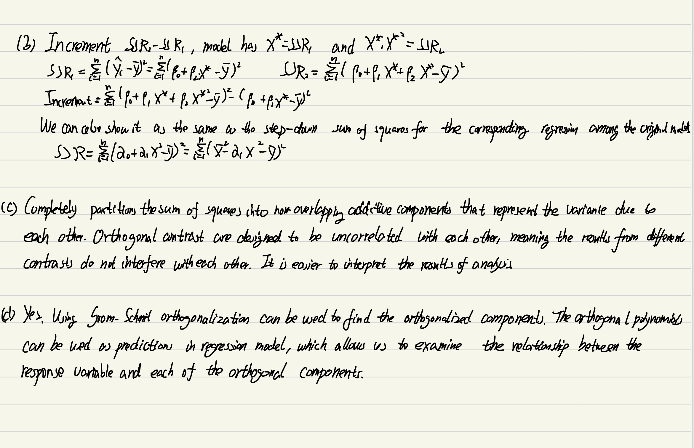

## Handwork  


  
### 18.3

```{r}
library(stats)
library(locfit)
set.seed(353)
n <- 100
x <- runif(n, 0, 100)
eps <- rnorm(n, 0, 20)
func1 <- function(x){100 - 5*( x/10 - 5) + ( x/10 - 5)^3} 
y <- func1(x) + eps
kernelRegression <- function (x, y, span = 0.5) {
  
tricube <- function (z) {
    ifelse (abs (z) < 1, (1 - (abs(z))^3)^3, 0)
  }
  
  n <- length(x)
  n.span <- round(span * n)
  yhat <- numeric(n)
  order <- order(x)
  x <- x[order]
  y <- y[order]
  
  for (i in 1:n) {
    x0 <- x[i]
    h <- sort(abs(x - x0))[n.span]
    yhat[i] <- weighted.mean(y, tricube((x - x0)/h))
  }
  
  return (list(x = x, y = yhat))
}

fit_kernel <- kernelRegression(x, y)
fit_local <- locfit(y ~ x)
```

```{r, echo = FALSE, eval = TRUE, warning = TRUE, result = TRUE,include = TRUE}
plot(x, y, pch = 16, col = "black")
x0 <- seq (0 , 100 , length =1000)
lines (x0 , func1(x0) , lwd =2 , lty =2, )
lines(fit_kernel, col = "blue", lwd = 2, lty = 1)
lines(fit_local, col = "red", lwd = 2, lty = 2)
legend("topleft", legend = c("True Function", "Kernel Regression", "Local Linear Regression"),
col = c("black", "blue", "red"), lty = c(2, 1, 2), lwd = 2)
```  
  
Hence, we can find that the kernel regression has a larger bias and the local regression has a lower bias.  
  
  
### 18.5  
```{r, warning=FALSE}
x <- sort(runif(n, 0, 100))
y <- func1(x) + rnorm(n, mean = 0, sd = 20)
mu <- func1(x)
spans <- seq(0.05, 0.95, by = 0.01)
ASEs <- rep(0, length(spans))
names(ASEs) <- as.character(spans)


for (span in spans) {
  yhat <- fitted(loess(y ~ x, span = span, degree = 1, family = "gaussian"))
  ASEs[as.character(span)] <- sum((yhat - mu)^2) / n
}
optimal_span <- spans[which.min(ASEs)]
```

```{r, echo = FALSE, eval = TRUE, warning = TRUE, result = TRUE,include = TRUE}
plot(x, y)
lines(x, mu, lwd = 2, col = "black")
lines(loess.smooth(x , y, span = optimal_span,family = "gaussian"), lwd = 2, lty = 3, col = "red")
plot(spans, ASEs, type = "l")
```
  
When the span is `r optimal_span` , we get the smallest ASE, it is much loser to the local linear regression(The red line in last image) in the question 18.3.  

*My policy on handwork is that it is required for Statistics PhD students and MS in Statistics students. It is encouraged (but not required) for MS in Applied Statistics and all other students. (If you are the latter, you will not get penalized if you get these wrong ... )*

Exercises from the book: 17.1, 17.2, 18.3, 18.5

You can type your answers and submit within this file *or* you can do this work on paper and submit a scanned copy (be sure it is legible).

## Data analysis  

### **1. Exercise D17.1** 
```{r, warning  = FALSE}
library(faraway)
library(mgcv)
library(arm)
library(MASS)
library(brant)
library("car") # load car and carData packages
```
The data in `ginzberg.txt` (collected by Ginzberg) were analyzed by Monette (1990). The data are for a group of 82 psychiatric patients hospitalized for depression. The response variable in the data set is the patient's score on the Beck scale, a widely used measure
of depression. The explanatory variables are "simplicity" (measuring the degree to which the patient "sees the world in black and white") and "fatalism". (These three variables have been adjusted for other explanatory variables that can influence depression.)  

Using the full quadratic regression model
$Y = \beta_0 + \beta_1X_1 + \beta_2X_2 + \beta_3X_1^2 + \beta_4X_2^2 + \beta_5X_1X_2 + \epsilon$
regress the Beck-scale scores on simplicity and fatalism.

(a) Are the quadratic and product terms needed here?

```{r}
Ginzberg = read.table("Datasets/Ginzberg.txt")
Ginzberg = na.omit(Ginzberg)

model <- lm(adjdepression ~ adjsimplicity + adjfatalism + I(adjsimplicity^2) + I(adjfatalism^2) + I(adjsimplicity * adjfatalism), data=Ginzberg)
summary(model)
```
  
From the summary table, we can find the p-values for simplicity$^2$ and fatalism$^2$ are larger than 0.05, which means the quadratic form is not needed here. However, the term of simplicity*fatalism has a p-vale slightly larger than 0.05, 0.0505.  
Then do a test using annova.  
```{r}
reduced_model <- lm(adjdepression ~ adjsimplicity + adjfatalism + I(adjsimplicity * adjfatalism), data=Ginzberg)
anova(reduced_model, model)
```  
  
We find the p-value is 0.5331 larger than 0.05, so we do not need this term.  

(b) If you have access to suitable software, graph the data and the fitted regression surface in three dimensions. Do you see any problems with the data?

```{r, echo = FALSE, eval = TRUE, warning = FALSE, result = TRUE,include = TRUE}
library(scatterplot3d)
library(plotly)
scatterplot3d(Ginzberg$adjsimplicity, Ginzberg$adjfatalism, Ginzberg$adjdepression,
             main = "3D Scatter Plot of Regression Surface",
             xlab = "adjsimplicity", ylab = "adjfatalism", zlab = "adjdepression")
fig <- plot_ly(x = ~Ginzberg$adjsimp, y = ~Ginzberg$adjfatal, z = ~model$fitted.values, type = "mesh3d")
fig
```
  
We find there is at least 1 obvious outliers in the scatter plot.  And there seems no quadratic relationship and tends to be linear.

(c) What do standard regression diagnostics for influential observations show?

```{r}
influenceIndexPlot(model, var=c('cook', 'hat'))
avPlots(model)
compareCoefs(model, update(model, subset=-c(71)))
```  
  
For Cook's distance 71th and 80th may be influential points, combined hat-values, 80th is the infuential points. To check that, we draw added-variable-plots and remove this point(71). We find it has a significant influence, then the 71th point is also an influential point.  

### **2. Exercise D18.2** 

For this analysis, use the `States.txt` data, which includes average SAT scores for each state as the outcome.

(a) Put together a model with SAT math (`SATM`) as the outcome and `region`, `pop`, `percent`, `dollars`, and `pay` as the explanatory variables, each included as linear terms. Interpret the findings.

```{r}
States = read.table("Datasets/States.txt")
States = na.omit(States)
model2 = lm(satMath ~ as.factor(region) + population + percentTaking + teacherPay, data = States)
summary(model2)
```
For this linear regression model, we treat region using as.factor(), which contains 9 levels and the region ENC is baseline for the model. The model can be expressed as $\hat{Y} = b_0 + b_1X_1 + ...b_12X_12$.  
The intercept 5.62e+02 is the average SAT math score when region is ENC holding other variables 0.  
For the coefficeints of variable $X_1 -- X_9$, which are the average difference in average SAT math score for which the corresponding region is at the level i and the region is not at the level i.  
For coefficients from $X_{10} -- X_{12}$, the coefficients represent the difference in SAT math score for each one unit increase in that explanatory variable, holding other variables constant.  
According to the p-values, percentTaking and regionSA are statistically siginificant for the model who have  p-values smaller than 0.05.  
  


(b) Now, instead approach building this model using the nonparametric-regression methods of this chapter. Fit a general nonparametric regression model *and* an additive-regression model, comparing the results to each other and to the linear least-squares fit to the data (in (a)).

```{r}
model2_2 = loess(satMath ~ population + percentTaking + teacherPay, degree=1, data = States)
summary(model2_2)

model2_3 = loess(satMath ~ percentTaking + teacherPay, degree=1, data = States)

# without percentTaking
model2_4 = loess(satMath ~ population + teacherPay, degree=1, data = States)

#without teacherPay
model2_5 = loess(satMath ~ population + percentTaking, degree=1, data = States)

anova(model2_3, model2_2) # The population is not significant.
anova(model2_4, model2_2) # The percentTaking is significant.
anova(model2_5, model2_2) # The teacherPay is not significant.

# Then we take percentTaking only.
model2_6 <- loess(satMath ~ percentTaking, degree=1, data=States)
```
```{r, echo = FALSE, eval = TRUE, warning = TRUE, result = TRUE,include = TRUE}
plot(satMath~percentTaking, data=States, col = "black")
increment <- with(States, seq(min(percentTaking), max(percentTaking), len=100)) 
preds <- predict(model2_6, data.frame(percentTaking=increment))
# loess curve
lines(increment, preds, lty=2, lwd=2, col="black")
lines(with(States, smooth.spline(percentTaking, satMath, df=3.85), lwd=2), col='blue')
abline(lm(satMath~percentTaking, data=States), col="red")


legend("topright", legend = c("Preds", "smooth.spline_per_stat","lm_sat_percentTaking"),
col = c("black", "blue", "red"), lty = c(2, 1, 2), lwd = 2)
```  
```{r}
model2_7<- gam(satMath ~ s(population) + s(percentTaking) + s(teacherPay), data = States)
summary(model2_7)
plot(model2_7)
```
  
Local regression is usually useful with 2 or 3 covariates, so we fit the local linear model without the catagorical variables. After that, we use anova table to analyze the reduced models. We find only the percenTaking is significant with p-value less than 0.05. Then we fit the model only with percentTaking. From the plots, the loess smooth spline line has the less bias and is closer to the local linear regression model fitted line than the linear regression model fitted line. Using additive regression model, we used gam model. p-value, smooth terms of percentTaking and teacherPay having a p-value less than 0.05 are statistically significant. Edf = 1 means a linear curve, edf = 2 means a quadratic curve. We find the smooth cuves of percentTaking and teacherPay are significant but not linear, and the smooth curves of population is linear but not significant. According to the dashed 95% band, it is consistent with our premise, and percentTaking seems to be quadratic, which is also consistent with what we have shown when comparing lines of local regression, smooth spline and linear regression. For the problem mentioned above,  it may be solved by a gam model.  

(c) Can you handle the nonlinearity by a transformation or by another parametric regression model, such as a polynomial regression? Investigate and explain. What are the tradeoffs between these nonparametric and parametric approaches?

```{r}
pairs(States[,c(2:7)])

ix <- sort(States$percentTaking, index.return=T)$ix
mod_percent_pl <- lm(satMath~I(percentTaking^2), data=States)
pred <- predict(mod_percent_pl)
plot(satMath~percentTaking, data=States)
lines(States$percentTaking[ix], pred[ix], col='red', lwd=2)
```
  
The percentTaking has a nonlinear relationship with SATMath score. Then we fit it with percentTaking$^2$, we find the fitting is much better than the linear fit.  
There are several trade-offs between nonparametric and parametric approaches in regression analysis. Nonparametric regression models are more flexible and can better capture complex relationships between the independent and dependent variables. Meanwhile, nonparametric regression models can be computationally intensive, especially when working with large datasets. Parametric regression models are simpler and faster to fit, but they may not provide an accurate representation of the data if the relationship is complex. For the assumptions, parametric regression models assume that the distribution of the errors and the form of the relationship between the variables. If the assumptions are not met, the results can be biased and unreliable. Nonparametric regression models make fewer assumptions, but they may be more sensitive to outliers and other sources of noise in the data. Parametric regression models are more interpretable, as the coefficients and other summary statistics provide a clear picture of the relationship between the variables. Nonparametric regression models may be more difficult to interpret, as the relationship between the variables is represented by a more complex function.  
  
  
### **3. Exercise D18.3**

Return to the `Chile.txt` dataset used in HW2. Reanalyze the data employing generalized nonparametric regression (including
generalized additive) models.

(a) What, if anything, do you learn about the data from
the nonparametric regression?

```{r}
Chile <- read.table("Datasets/chile.txt")
Chile <- Chile[complete.cases(Chile), ]
Chile <- Chile[Chile$vote %in% c("Y", "N"),]

for (i in 1:nrow(Chile)) {
  if(Chile$vote[i] == "N"){
    Chile$outcome[i] = 0
  }
  else{
    Chile$outcome[i] = 1
  }
}

model3_1 <- gam(outcome ~ region + sex + education + income + 
                      s(population) + s(age) + s(statusquo), family = binomial, data = Chile)
summary(model3_1)
plot(model3_1)

# Status quo as a linear term
model3_2 <- gam(outcome ~ region + sex + education + income + s(population)
                         +s(age) + statusquo, family = binomial, data = Chile)

#compare
anova(model3_2, model3_1, test = "Chisq")  

#Nonparametric 
# loess
model3_3 = loess(outcome ~ statusquo, degree = 1, data = Chile)
increment = with(Chile, seq(min(statusquo), max(statusquo), len = 100))
preds = predict(model3_3, data.frame(statusquo = increment))

# regular logistic regression
model3_4 = glm(outcome ~ statusquo, family = binomial, data = Chile)
predicted_data = data.frame(statusquo = seq(min(Chile$statusquo), max(Chile$statusquo),len = 100))
predicted_data$outcome = predict(model3_4, predicted_data, type = "response")

plot(outcome ~ statusquo, data = Chile)
lines(with(Chile, smooth.spline(statusquo, outcome, df = 3.85), lwd = 2),col = "blue")
lines(outcome ~ statusquo, predicted_data, lwd = 2, col = "red")
```  

We conducted a GAM analysis on a Chile dataset. The results showed that among the parametric coefficients, only gender and education had p-values less than 0.05, indicating that they were statistically significant. On the other hand, the smooth term for the status quo was found to be the only one with p-value less than 0.05 among the approximate significance of smooth terms. The smooth curve of the status quo was observed to be linear, and there was no evidence of non-linearity between the status quo and the dependent variable vote. A comparison between the model with the smooth term of the status quo and the model without it was done through an anova chi-square test, which showed a p-value of 0.2117. This result suggested that the null hypothesis could not be rejected, indicating that the model with the linear term of the status quo was a better fit for the data. This suggested that the nonparametric regression did not offer much insight into the data. In addition to the GAM analysis, we also fit a local linear regression model using only the significant continuous variable status quo, as well as a parametric logistic regression. Here, we can see an S-shaped curve, although the loess curve is not as steep as our logistic regression curve. The plots of these models showed that the logistic regression model (represented by a red line) provided a better fit for the data compared to the local linear regression model (represented by a blue line).  

  
(b) If the results appear to be substantially nonlinear, can you deal with the nonlinearity in a suitably respecified generalized linear model (e.g., by transforming one or more explanatory variables)?

```{r}
hist(Chile$statusquo)
model_log <- glm(outcome~log(statusquo+2),family=binomial,data=Chile)
model_sqrt <- glm(outcome~sqrt(statusquo+2),family=binomial,data=Chile)
model_poly<- glm(outcome~I(statusquo^2),family=binomial,data=Chile)

summary(model_log)
summary(model_log)
summary(model_log)

# summary(mod_log) # summary(mod_sqrt) # summary(mod_poly)

log_pred_data <- data.frame(statusquo=seq(min(Chile$statusquo),max(Chile$statusquo),len=100))
sqrt_pred_data <- data.frame(statusquo=seq(min(Chile$statusquo),max(Chile$statusquo),len=100))
sq_pred_data <- data.frame(statusquo=seq(min(Chile$statusquo),max(Chile$statusquo),len=100))

log_pred_data$outcome <- predict(model_log,log_pred_data,type="response")
sqrt_pred_data$outcome <- predict(model_sqrt,sqrt_pred_data,type="response")
sq_pred_data$outcome <- predict(model_poly,sq_pred_data,type="response")

plot(outcome~statusquo,data=Chile)
lines(outcome~statusquo,predicted_data,lwd=2,col="red")
lines(outcome~statusquo,log_pred_data,lwd=2,col="blue")
lines(outcome~statusquo,sqrt_pred_data,lwd=2,col="green")
lines(outcome~statusquo,sq_pred_data,lwd=2,col="purple")
```
The outcomes seems not to be significantly non-linear, we include statusquo as the only significant continuous varible. We use log, sqrt and the square of statusquo to examine the non-linearity. After plotting the predicted curves: the curve for the basic logistic regression model without any transformation (represented in red). The log transformation is shown in blue, the square root transformation in green, and the square of “statusquo” in purple. From it, it’s apparent that squaring “statusquo” does not behave well. A comparison between the linear logistic regression and the log and square root transformations shows very little difference, which suggests that there’s likely no significant distinction between these models.  
  

### **4. Exercise E18.7**

For this analysis, use the `Duncan.txt` data. Here we are interested in the outcome `prestige` and the explanatory variable `income`.

(a) Fit the local-linear regression of prestige on income with span $s = 0.06$ (see Figure 18.7 in the book). This has 5.006 equivalent degrees of freedom, very close to the number of degrees of freedom for a fourth order polynomial.  

```{r}
Duncan = read.table("Datasets/Duncan.txt")
model4_1 <- loess(prestige ~ income, data = Duncan, span = 0.6, degree = 1)
summary(model4_1)
income = with(Duncan, seq(min(income), max(income), len = 100))
pred <- predict(model4_1, data.frame(income = income))

plot(prestige~income, data = Duncan)
lines(income, pred, lty = 2, lwd = 2)
```  
In this plot, we can find apparent linear relationship between prestige and income using the local linear regression model. The slope of the line at any given point indicates the local relationship between prestige and income. The slope can change as the value of income changes, allowing the model to capture non-linear relationships between the variables. However, in this case, there is obvious linear pattern, we are not necessarily to use the local linear regression.  
  
(b) Fit a fourth order polynomial of the data and compare the resulting regression curve with the local-linear regression.

```{r}
# Fit the fourth-order polynomial regression model
model4_2 <- lm(prestige ~ poly(income, 4), data = Duncan)

# Predict the prestige values for a grid of income values
income_grid <- seq(min(Duncan$income), max(Duncan$income), length.out = 100)
pred_poly <- predict(model4_2, newdata = data.frame(income = income_grid))

# Fit the local linear regression model
fit_loess <- loess(prestige ~ income, data = Duncan, span = 0.6)
pred_loess <- predict(fit_loess, newdata = data.frame(income = income_grid))

# Plot the original data and the fitted models
plot(Duncan$income, Duncan$prestige, pch = 20, col = "blue", xlab = "Income", ylab = "Prestige")
lines(income_grid, pred_poly, col = "red", lwd = 2, lty = 1,
      main = "Fourth-Order Polynomial Regression vs. local linear Regression",
      xlab = "Income", ylab = "Prestige")
lines(income_grid, pred_loess, col = "green", lwd = 2, lty = 2,
      xlab = "Income", ylab = "Prestige")
legend("bottomright", legend=c("Fourth-Order Polynomial Regression", "local linear regression", "Original Data"), 
       col=c("red", "green", "blue"), lty=c(1, 2, NA), pch = c(NA, NA, 20))
```
  
After fitting a fourth order polynomial of the data, it may behave better than local linear regression because it is a little bit closer. In general, they are similar and both of them fit it well.  
