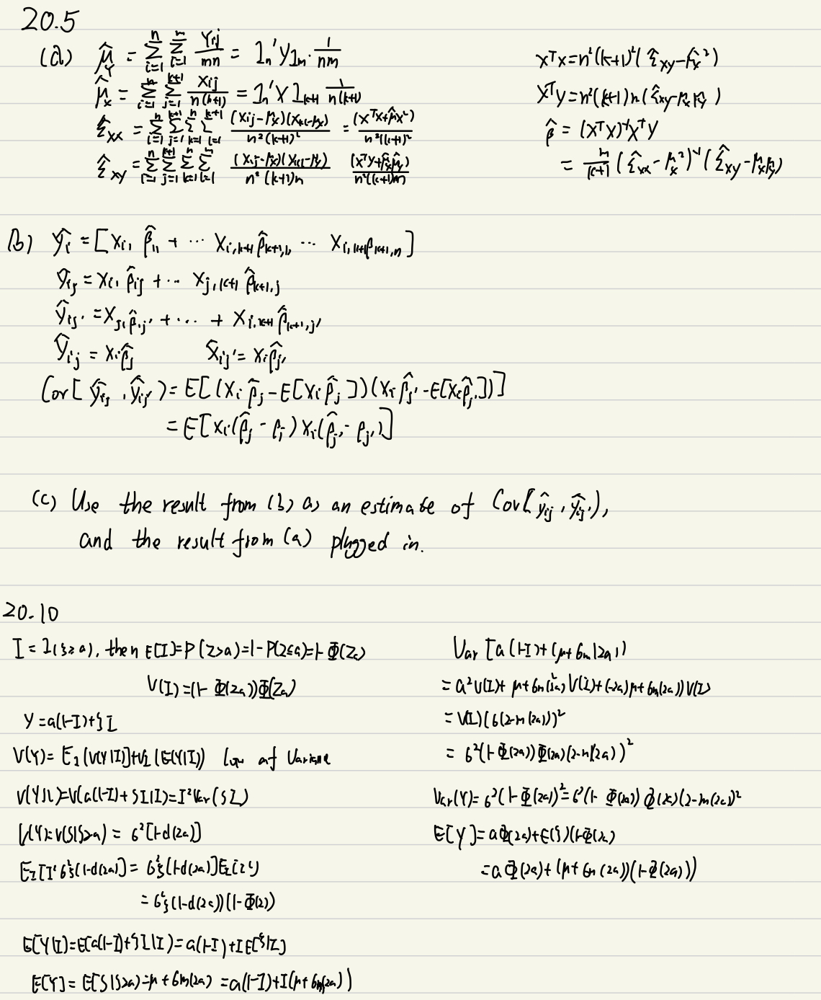
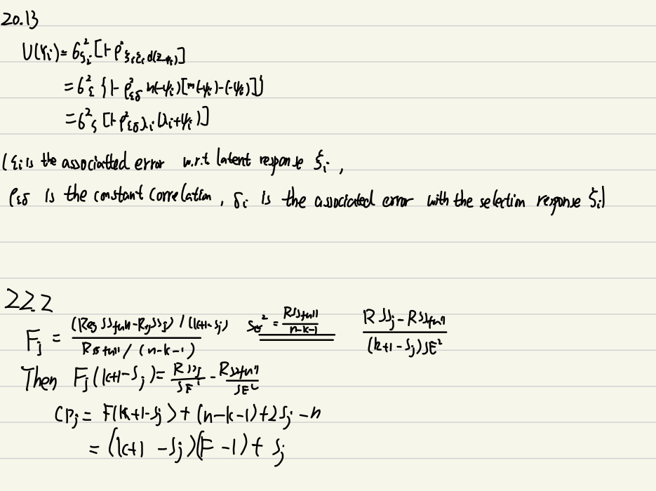

```{r setup, include=FALSE}
knitr::opts_chunk$set(echo = TRUE)
```

## Handwork

*My policy on handwork is that it is required for Statistics PhD students and MS in Statistics students. It is encouraged (but not required) for MS in Applied Statistics and all other students. (If you are the latter, you will not get penalized if you get these wrong ... )*

Exercises from the book: 20.5, 20.10, 20.13, 21.4, 22.2


  
```{r}
# Load the packages
library(boot)
library(car)
library(tidyverse)
library(sampleSelection)
library(caret)
library(mice)
library(censReg)
```  
  
### 21.4  
```{r}
set.seed(353)
n <- 10 
y <- rnorm(n, mean = 0, sd = 10)
y_bar <- mean(y) 
 #sample variance
sample_var <- sum((y - y_bar)^2)/n

#define a function to calculate the variance of a bootstrap sample
bootstrap_var <- function(data, index){
X <- data[index] # Get the boostrap sample
x_bar <- mean(X)
sum((X - x_bar)^2)/(n - 1) # Bootstrap variance
}

# Perform bootstrap to estimate variance
bootstrap_results <- boot(data = y, statistic = bootstrap_var, R = 500) 
bootstrap_estimate <- bootstrap_results$t0 
# Calculate bias in variance estimate
bias_estimate <- bootstrap_estimate - sample_var 
bias_estimate
```  
  
Based on the bootstrap analysis, it appears that the estimated bias is `r bias_estimate`, which is significantly different from the theoretical value of -10. However, considering the small size of the sample, such a deviation is not surprising. As the number of replications is increased, the estimated bias is expected to approach the theoretical value, indicating that the initial difference is likely due to chance fluctuations.  


You can type your answers and submit within this file *or* you can do this work on paper and submit a scanned copy (be sure it is legible).

## Data analysis

### **1. Exercise D20.1 (MI)**

Using the United Nations social-indicators data (in `UnitedNations.txt`), develop a regression model for the response variable female expectation of life. Feel free to use whatever explanatory variables in the data set make sense to you, and to employ variable transformations, methods of fitting the model other than least-squares regression (e.g., nonparametric), etc.

(a) Work initially with complete cases, and once you have an apparently satisfactory model,obtain estimates and standard errors of the regression coefficients.

```{r}
UN <- read.table("Datasets/UnitedNations.txt")
UN <- UN[complete.cases(UN), ]

# EDA
scatterplotMatrix(UN[,-1])
# From the plot above GDP appears to need a log transformation
model11 <- lm(lifeFemale~. -GDPperCapita-lifeMale+log(GDPperCapita), data=UN)
# Check LR test for significant variables
Anova(model11)
# Based on the P-value we have our Refined model
model12 <- lm(lifeFemale~region+tfr+infantMortality+economicActivityFemale, data=UN)
S(model12)
crPlots(model12)
outlierTest(model12)
residualPlots(model12)
```
Upon reviewing the scatter matrix plot, it was apparent that a logarithmic transformation of GDPperCapita might be necessary. Furthermore, we observed a correlation between the response variables lifeFemale and lifeMale. Hence, the initial model excluded lifeMale and included all other variables while performing a log transformation on GDPperCapita. Using the ANOVA's likelihood ratio test, we found that the variables region, tfr, infantMortality, and economicActivityFemale had p-values below 0.05, indicating that they were statistically significant. Consequently, these variables were incorporated into the revised model.  
Then we get the model: $\hat{Y} = 0.4752 + 0.9613X_1+2.5902X_2+0.7270X_3$. The intercept $\beta_0=81.6638$ means that when region is Africa and all other variables are 0, the expected female life expectancy at birth is 81.6638 years with a standard error of 2.8497. For the coefficients of $X_1, X_2, X_3, X_4$, they stands for levels 1 to 4, holding other variables constant, $\hat{\beta_i}$ is the average difference in expected female life expectancy at birth when region is at level i. The model has 5 levels for region: Africa, America, Asia, Europe, and Oceania. The baseline for the model is Africa. $\hat{beta_5}$=−1.4428 represents the difference in expected female life expectancy at birth for each one-unit increase in tfr (total fertility rate, number of children per woman), holding all other variables constant, with a standard error of 0.8078. $\hat{beta_6}$ = −0.1717 shows the difference in expected female life expectancy at birth for each one-unit increase in infantMortality (infant deaths per 1000 live births), holding all other variables constant, with a standard error of 0.0333.

(b) Now redo your analysis in (a) but use multiple imputation.

```{r}
UN <- read.table("Datasets/UnitedNations.txt", header = TRUE)
m <- 5
seed <- 353
# Perform multiple imputations using "mice"
UN_imputed <- mice(UN, m = m, seed = seed, maxit=20, printFlage=FALSE)
models <- with(UN_imputed, {
  lm(lifeFemale ~ region + tfr + contraception + educationMale +
     educationFemale + infantMortality + log(GDPperCapita) + 
     economicActivityMale + economicActivityFemale +
     illiteracyMale + illiteracyFemale)
})

pooled_model <- pool(models)
summary(pooled_model)
## refine the model
refined_imputed_models <- with(UN_imputed, {
  lm(lifeFemale~region+tfr+infantMortality+economicActivityFemale)
})

refined_pooled_models <- pool(refined_imputed_models)
summary(refined_pooled_models)

```
  
I conducted two linear regression models(fit and pool) using multiple imputations: one with a larger set of predictor variables and another with a refined set of predictor variables. The variables region, tfr, log(GDPperCapita), infantMortality, and economicActivityFemale from the original multiple imputation model are statistically significant with p-values less than 0.05. In order to make a fair comparison with the original model, the new model in a) includes all of these significant variables, except for log(GDPperCapita).  

(c) Compare these results to those from the complete-case analysis. What do you conclude?

```{r}
summary(model12)
summary(refined_pooled_models)
```
Based on the summary results of the two models, we can observe that the estimates obtained from the complete case model are comparable to those of the multiple imputation model, but the former has larger standard errors. Additionally, all variables in the multiple imputation model are statistically significant, while tfr in the complete case model is not statistically significant. It is important to note that the complete case model has a smaller sample size, whereas the multiple imputation model utilizes all available data and accounts for uncertainty in the imputed values, increasing precision. Therefore, based on these findings, the multiple imputation model is preferred over the complete case model, as it can provide more accurate and unbiased estimates.  

### **2. Exercise D20.3 (Selection)**

Long (1997) reports a regression in which the response variable is the prestige of the academic departments where PhDs in biochemistry find their first jobs. The data are in the file `Long-PhDs.txt`.

Prestige is measured on a scale that runs from 1.00 to 5.00, and is unavailable for departments without graduate programs and for departments with ratings below 1.00. The explanatory variables
include a dummy regressor for gender; the prestige of the department in which the individual obtained his or her PhD; the number of citations received by the individualís mentor; a dummy regressor coding whether or not the individual held a fellowship; the number of articles published by the individual; and the number of citations received by the individual.

Estimate the regression of prestige of first job on the other variables in three ways:

(a) code all of the missing values as 1.00 and perform an OLS regression;

```{r}
phd <- read.table("Datasets/Long-PhDs.txt", header = TRUE)

phd_ols <- phd
# Replace missing values in the "job" column with 1
phd_ols$job[is.na(phd_ols$job)] <- 1.00

model21 <- lm(job ~ gender + phd + mentor + fellowship + articles + citations, data = phd_ols)
# Display the summary of the OLS model
summary(phd_ols)
```  
According to the output, only three variables phd, fellowship, and citations are statistically significant.  
```{r}
model21_reduced = lm(job ~ phd + fellowship + citations, data = phd_ols)
anova(model21_reduced, model21)
```
The p-value is larger than 0.05, we don't reject the null hypothesis.  
```{r}
model22 <- model21_reduced
summary(model21_reduced)
```
(b) treat the missing values as truncated at 1.00 and employ Heckmanís selection-regression model;

```{r}
phd_heck <- phd
phd_heck <- mutate(phd_heck, lfp = if_else(job > 1, "1", "0"))
phd_heck$lfp[is.na(phd_heck$lfp)] <-  0
model23 <- selection(lfp ~ phd + fellowship + citations,
                              job ~ phd + fellowship + citations, data = phd_heck)
summary(model23)
```

(c) treat the missing values as censored and fit the Tobit model.

```{r}
phd_tobit = phd
phd_tobit$job[is.na(phd_tobit$job)] = 1
model24 <- censReg(job ~ phd + fellowship + citations, left = 1, right = Inf, data = phd_tobit)
summary(model24)
```

(d) Compare the estimates and coefficient standard errors obtained by the three approaches. Which of these approaches makes the most substantive sense?

```{r}
compareCoefs(model22, model23, model24)
```
The OLS approach is a simple method that replaces all missing values with 1, consistently produces the smallest standard error for each variable. However, this approach may introduce bias because it assumes all missing values are equal to 1. In contrast, the Heckman selection-regression model reveals that as the prestige of the PhD department increases by 1, the prestige of the first job increases by 0.353. Individuals with a fellowship tend to have a 0.296 higher first job prestige, and a 1-unit increase in citations leads to a 0.0054 increase in first job prestige. The Tobit model has similar coefficient values to the Heckman selection-regression model. However, the Heckman selection-regression model has lower standard errors for each variable, making it a preferable choice. The missing data may not be within the range of possible values, leading respondents to refrain from responding because they cannot find a suitable value within the given range (1-5). Additionally, there are notable differences in the coefficient estimates for gendermale and fellowshpyes between the three approaches.  

### **3. Exercise (Bootstrap)**

We will now consider the `Boston` housing dataset from the `MASS` package.

```{r boston}
data(Boston, package = "MASS")
??Boston
```

(a) Provide an estimate of the population mean of `medv`. Call this estimate $\hat{\mu}$.

```{r}
mu_hat <- mean(Boston$medv)
mu_hat
```

(b) What is the formula for the standard error of an estimate of the mean? Use this to provide an estimate of the standard error of $\hat{\mu}$ in (a).
```{r}
n<-sum(!is.na(Boston$medv))
medv_sd <- sd(Boston$medv)
medv_sd <- medv_sd/(sqrt(n))
medv_sd
```
The standard error of an estimate of the mean($\hat{mu} = \frac{1}{n}\sum X_i$, X_i: i.i.d.) is $\frac{s}{\sqrt{n}} = \frac{9.197104}{\sqrt{506}} = 0.4088611$ ($s^2$ is the sample variance).

(c) Estimate this standard error using the bootstrap. How does this compare to the answer from (b)?
```{r}
mean_func <- function(data, i) {
  return(mean(data[i]))
}

set.seed(353) 
boot_means <- boot(data = Boston$medv, statistic = mean_func, R = 100000)
boot_sd <- sd(boot_means$t)

boot_sd
```

Using the bootstrap method, the standard error of the sample mean for "medv" is calculated to be `r medv_sd`, which is very close to the value of `r boot_sd`` obtained in (b). This indicates that the assumption of normality is not significantly violated, as the difference between the two standard errors is not substantial. Therefore, it is reasonable to assume normality for the 'medv' variable in the given dataset.

(d) Provide an estimate of $\hat{\mu}_{med}$, the  median value of `medv` in the population.
```{r}
medv_median <- median(Boston$medv)
medv_median
```


(e) Estimate the standard error of $\hat{\mu}_{med}$. Notice that there is no simple formula to do this, so instead use the bootstrap. Comment on your findings.
```{r}
median_func <- function(data, i) {
  return(median(data[i]))
}

set.seed(353) 
boot_medians <- boot(data = Boston$medv, statistic = median_func, R = 100000)
boot_medianSE <- sd(boot_medians$t)

boot_medianSE
```
The standard error of the median obtained through the bootstrap method is typically lower than that of the mean. This is because the median is less sensitive to outliers than the mean. Outliers, or extreme values, can greatly affect the value of the mean, leading to a larger standard error. However, the median only considers the middle value of the dataset, and is not influenced as much by extreme values. As a result, the median is often considered to be a more robust measure of central tendency than the mean. Also, the small value of the estimated standard error may indicate that our estimator is relatively accurate.

### **4. Exercise D22.1 (Model Selection)**

The data file `BaseballPitchers.txt` contains salary and performance data for major-league baseball pitchers at the start of the 1987 season. The data are analogous to those for baseball hitters used as an example in the chapter. Be sure to explore the data and think about variables to use as predictors before specifying candidate models.

(a) Employing one or more of the methods of model selection described in the text, develop a regression model to predict pitchers' salaries.

```{r}

BP <- read.table("Datasets/BaseballPitchers.txt", header = TRUE)
BP <- BP[, 3:18]

model41 <- lm(salary ~ ., data = BP)
base <- lm(salary ~ 1, data = BP)

model42 <- step(base, scope = list(lower = base, upper = model41), direction = "both", trace = TRUE)
summary(model42)
```
We select the model using the direction of "both". The chosen variables are years careerERA IP86 careerSV and G86.

(b) How successful is the model in predicting salaries? Does the model make substantive sense?

```{r}
final_model <- lm(salary ~ years + careerERA + IP86 + careerSV + G86, data = BP)
fitted_values <- final_model$fitted.values

BP <- BP[complete.cases(BP),]
# Calculate the root mean squared error between fitted values and actual salaries
rmse <- sqrt(mean((fitted_values - BP$salary)^2))
rmse
```
After using the cross validation, we can get the RMSE of the model. It is 282.39. This is a quite good result in compare with the full model, suggesting that the model can be used to predict the salary. This model appears to be reasonable since the type of league can significantly influence salaries, while the length of the career (years) and other significant variables can also play a crucial role in determining salaries.